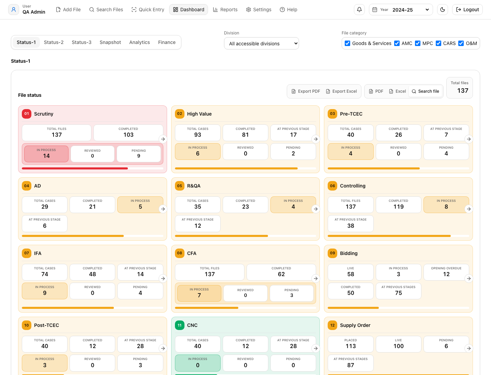
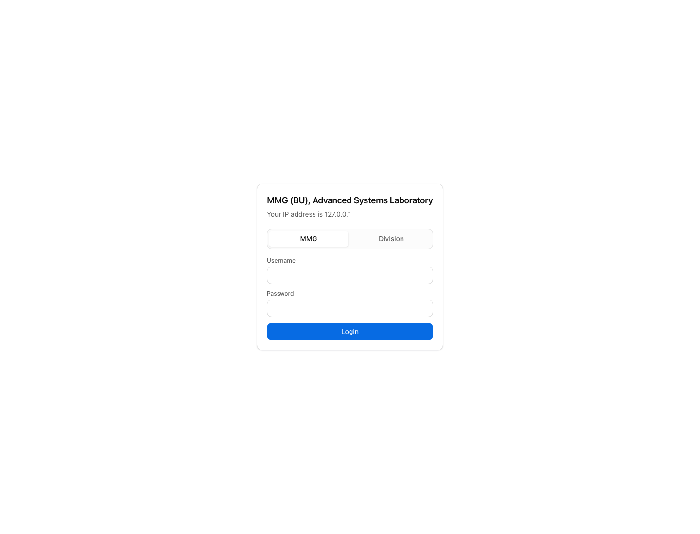
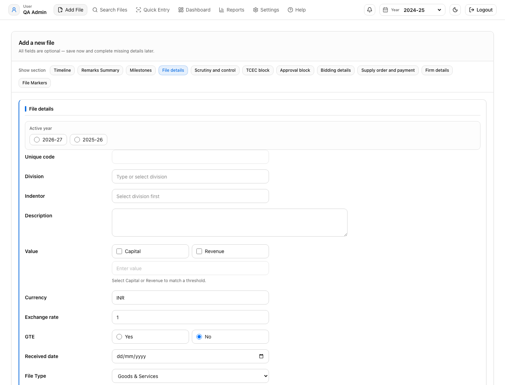
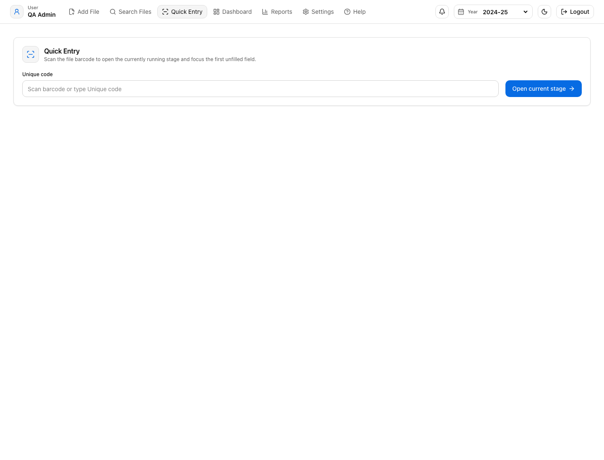
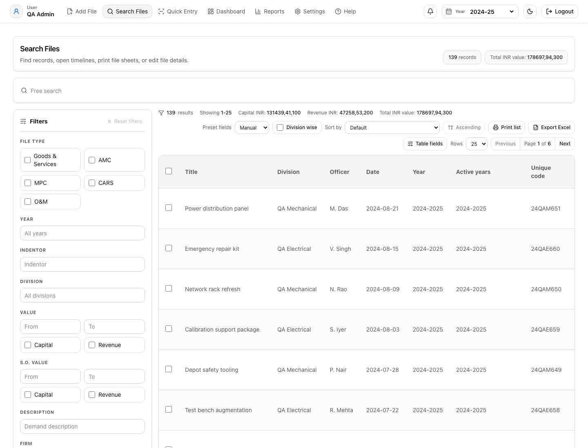
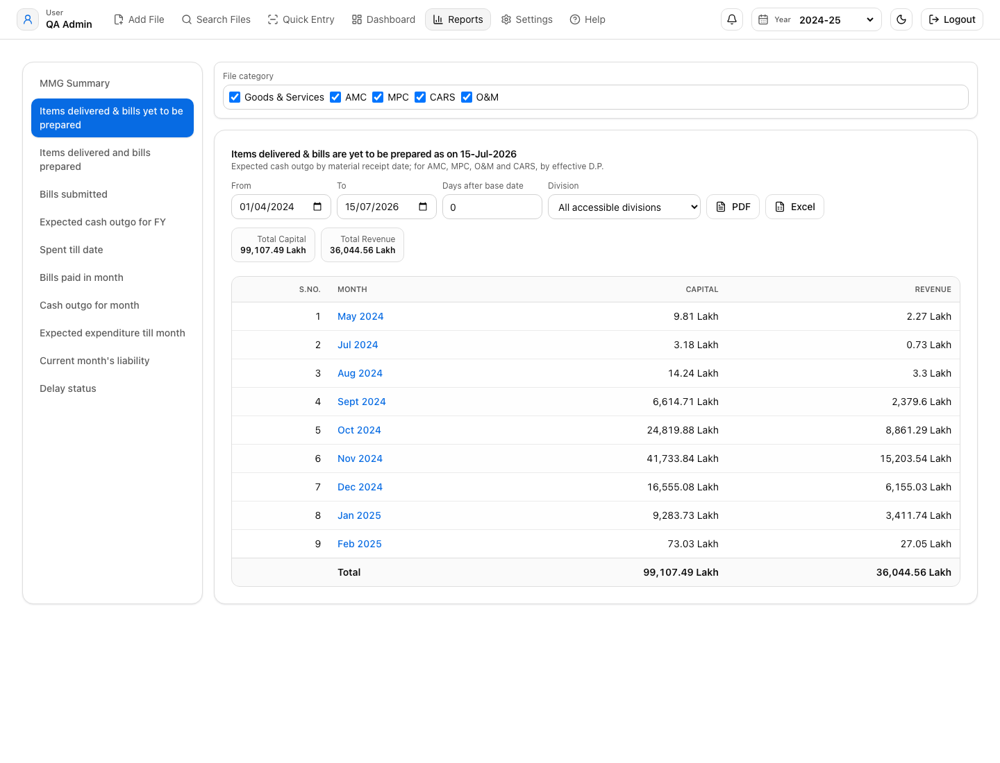
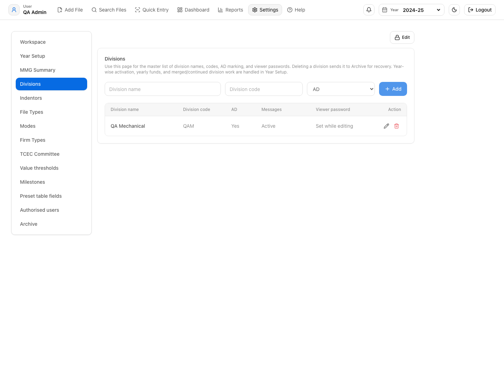

# File Tracking Software

**Document status:** Draft user/admin manual  
**Audience:** Admins, sub-admins, editors, division users, viewers, and report users  
**Screenshot convention:** Screenshots are embedded in the Help/PDF build. Refresh screenshots after major UI changes.

---

## Index

1. [Introduction](#1-introduction)
2. [User Roles and Access](#2-user-roles-and-access)
3. [Login and Navigation](#3-login-and-navigation)
4. [Home Page](#4-home-page)
5. [Add File Page](#5-add-file-page)
6. [Quick Entry Page](#6-quick-entry-page)
7. [Search File Page](#7-search-file-page)
8. [Dashboard Page](#8-dashboard-page)
9. [Reports Page](#9-reports-page)
10. [Settings Page](#10-settings-page)
11. [Financial Year Logic](#11-financial-year-logic)
12. [Unique Code Logic](#12-unique-code-logic)
13. [File Lifecycle and Milestone Logic](#13-file-lifecycle-and-milestone-logic)
14. [Supply Order, Stage Delivery, and Payment Logic](#14-supply-order-stage-delivery-and-payment-logic)
15. [Archive, Delete, and Restore Logic](#15-archive-delete-and-restore-logic)
16. [Exports, Printing, and Table Fields](#16-exports-printing-and-table-fields)
17. [Data Entry Standards and Precautions](#17-data-entry-standards-and-precautions)
18. [Dashboard and Reports Counter/Clicker Logic](#18-dashboard-and-reports-counterclicker-logic)
19. [Troubleshooting](#19-troubleshooting)

---

## 1. Introduction

File History is a records and procurement tracking application for managing procurement files, milestones, supply orders, payments, delay status, financial year-wise reporting, dashboard summaries, and MMG reporting.

The system is designed around these principles:

- Every procurement file is recorded with a unique code, financial year, division, file type, mode, value, and milestone details.
- A file can have one or more Supply Orders.
- A Supply Order can have staged delivery and staged payment.
- Reports and dashboards use the entered dates, current status, completed milestones, cancellation flags, and settings.
- A counter may represent files, Supply Orders, stages, payment entries, or values. Therefore, clicking a counter may show fewer files than the counter number when multiple counted items belong to the same file.

### Main Users

- Admin users who configure settings, years, divisions, users, and archive rules.
- Editors who enter and update file data.
- Sub-admins who manage selected administrative functions.
- Division users/viewers who only see permitted divisions or file categories.
- Report users who review dashboard, analytics, delay status, and cash outgo.

### Key Modules

- Home
- Add File
- Quick Entry
- Search File
- Dashboard
- Reports
- Settings
- Archive
- Year Setup

---

## 2. User Roles and Access

Access is controlled by user role, assigned divisions, and allowed file categories.

### Admin

Admin users can generally:

- Add, edit, and archive files.
- Manage settings.
- Manage users.
- Manage divisions.
- Manage financial years.
- Manage table fields and MMG fields.
- Access all file categories unless restricted by configuration.

### Sub-admin

Sub-admin users may have broad operational access but may not have every administrative permission. Their actual visibility depends on assigned divisions and file category permissions.

### Editor

Editor users can enter and update file records as permitted by their role and access scope.

### Division User / Viewer

Division-scoped users see only assigned division data. If file category access is configured, they see only allowed categories on dashboard, reports, and search.

### Access Rules

- Division restriction limits records by division.
- File category restriction limits file type options and report/dashboard visibility.
- Backend APIs also enforce access, so hidden records should not appear through search or reports.

### Precautions

- Do not give admin access unless required.
- Review file category access after adding new file types.
- Verify division access after merging, splitting, or deactivating divisions.
- When testing report counts, use an admin account first, then test restricted users separately.

---

## 3. Login and Navigation

### Login

Users log in with username and password.

If the software does not log in:

- Confirm the backend is running.
- Confirm the website is connected to the correct backend.
- Confirm the database contains an active user.
- Clear browser cookies/site data if switching between test and production databases.

### Navigation

The navigation usually includes:

- Home / Dashboard
- Add File
- Quick Entry
- Search File
- Reports
- Settings
- Messages / MMG Live, where enabled

### Precautions

- Use one browser tab when editing critical files.
- Avoid switching financial year during data entry.
- Confirm the selected financial year before searching or adding records.

---

## 4. Home Page

The Home page is the entry point after login. Depending on routing, it may redirect to Search or Dashboard.

### Purpose

The Home page gives quick access to the main workflows:

- Search existing files.
- Add a new file.
- Review dashboard status.
- Open reports.
- Update settings if authorised.

### Logic

The Home page uses current user role, selected financial year, and access restrictions to determine what the user can see.

### Precautions

- If the Home page appears blank, check login session and backend health.
- If expected navigation options are missing, check user role and permissions.

---

## 5. Add File Page

The Add File page is used to create a new file or edit an existing file.

### Main Sections

- Basic file details
- Financial and classification details
- Pre-Supply Order milestones
- Tender and bidding details
- Supply Order details
- Delivery and inspection details
- Payment details
- Cancellation and archive-related fields
- Remarks and markers

### Basic File Details

Typical fields include:

- Division
- Control no.
- Financial year
- Unique code
- File number
- Indentor
- Demand description

### Logic

- Division must exist in settings.
- Financial year should be valid and selected from configured years.
- Unique code is generated using financial year prefix, division code, and serial.
- Active years determine in which financial years a file remains visible.

### Actual Code Logic: Year, Unique Code, and Active Years

The Add File page does not allow free typing of the file year. It calculates the working year from the selected system year:

- If the selected year is a normal financial year, that year is used.
- If the selected year is `All active files`, the current workspace financial year is used.
- For a new file, the first selected active year is used for unique-code generation.
- For an existing file, the original file year remains the base year; active years are used only to keep the file visible in later years.

Only two active-year options are shown in Add File. The software takes the current effective financial year, adds the configured financial years from Settings, sorts them latest-first, removes duplicates, and keeps only the latest two. This is why, at one time, only two years are visible for selection. The purpose is to allow the current year and one carry-forward/recent year without letting users keep a file active across many accidental years.

If year selection is locked in Settings, the Add File page allows only the fallback/effective year. If year selection is unlocked, the user can choose from the latest two options only. If an older file has active years outside the latest two, the page normalizes the selection back to an allowed year when loaded.

The file becomes visible in Search/Dashboard/Reports for a year when:

- the file's original `year` matches that year, or
- the file's `activeYears` includes that year.

For `All active files`, the file is visible only if it is still active. A file is treated as inactive when payment is completed or it is cancelled as per the cancellation logic.

### Actual Code Logic: Section Locks

When adding a new file, fields are editable according to the user's role and enabled options.

When editing an existing file, important blocks are locked by default. The user must unlock the relevant block before changing filled values. Common locked blocks include:

- Firm details
- File Markers
- Supply order and payment
- Milestones

The lock is not only visual. The code checks the locked state before allowing changes. If the user is in read-only mode, all edit handlers return without saving changes. Demand cancellation has an additional protection: it requires deletion-password confirmation before it can be unlocked.

### File Markers

File Markers are file-specific keywords or short notes used to make a file easier to find later.

They are useful when the normal file fields may not contain the word by which users commonly remember the case. Example markers:

- urgent
- CFA follow-up
- vendor complaint
- priority inspection
- awaiting clarification

### Actual Code Logic: File Markers

File Markers do not change file status, milestones, delay status, dashboard counters, finance values, or reports. Their main purpose is searchability.

Actual behavior:

- A file can have multiple markers.
- Each marker has marker text, an internal ID, creation date, and saved display order.
- Marker words are included in the main Search free-text box.
- Blank marker rows are removed during save.
- Marker text is trimmed before save.
- In an existing file, the File Markers block is locked by default.
- The user must unlock the File Markers block before adding, editing, or deleting markers on an existing file.
- In read-only mode, markers cannot be added, edited, or deleted.
- On backend save, the previous marker list for that file is replaced with the current marker list.

Example:

If a file has marker text vendor complaint, searching complaint in Search File can bring that file even if complaint is not written in the title, demand description, firm name, or S.O. fields.

Precautions:

- Use short, meaningful keywords.
- Do not use File Markers as a substitute for official remarks or milestone dates.
- Do not enter sensitive personal information unless the same information is allowed to be searchable.
- If a marker does not bring the file in Search, check financial year, division access, file category access, and archive/cancellation filters.

### File Category and Mode

File category is derived from file type. Common categories include:

- Goods & Services
- AMC
- MPC
- CARS
- O&M

Mode is selected from configured mode values such as OBM, PBM, SBM, LBM, LPC, or locally configured values.

### Milestone Dates

Milestone dates must be entered in sequence as far as possible.

Common milestone fields include:

- Received date
- Scrutiny date
- Scrutiny response date
- Scrutiny completion date
- Controlling / Control no. date
- High Value meeting and minutes
- Pre-TCEC date and minutes
- AD vetting
- R&QA approval
- IFA sent and final
- CFA sent and approval
- Tender / bid dates
- Post-TCEC date and minutes
- CNC date and approval

### Actual Code Logic: File-Level Milestone Page

The Milestones block shows only applicable milestones. Applicability is calculated from the file flags:

- High Value appears only when High Value is `Yes`.
- Pre-TCEC, Post-TCEC, and CNC appear only when TCEC is `Yes`.
- AD appears only when AD is `Yes` and the selected division is not configured as AD-not-required.
- R&QA appears only when R&QA is `Yes`.
- IFA appears only when IFA is `Yes`.
- Bank Guarantee appears only when BG is `Yes`.
- IR Preparation and IR Receipt appear only when IR is `Yes`.
- Other normal milestones remain applicable by default.

The Current checkbox for a milestone is disabled when:

- the user has no edit permission or the page is read-only,
- the milestone is not applicable,
- the milestone is already completed,
- the milestone is `File Closed`,
- the milestone is driven by S.O./stage progress, or
- the Milestones block is still locked and a current milestone is already filled.

The Completed checkbox for a milestone is disabled when:

- the user has no edit permission or the page is read-only,
- the milestone is not applicable,
- the milestone is automatically completed from date/data fields,
- the milestone is driven by S.O./stage progress, or
- the Milestones block is still locked and that completed milestone was already saved.

This is why main file-level milestone checkboxes may appear locked. For S.O.-driven milestones, the main file checkbox is not the source of truth. The software reads progress from the Supply Order/stage rows and shows progress like `2/3 stages done` or `1/2 supply orders done`.

When a user manually marks a milestone as completed, and that same milestone was selected as current, the software clears the current milestone. This prevents a milestone from being both current and completed at file level.

Precaution: do not select Current and Completed for the same milestone at the same time. If a stage is complete, only Completed should remain selected. Current is only for the stage where action is still pending.

### Actual Code Logic: Automatic Completion and Validation

Some milestones are completed automatically when their actual completion field is present. The manual checkbox and the date field must remain consistent. The software checks for both types of mismatch:

- a completion date exists but the milestone is not completed,
- the milestone is completed but the required completion date is missing.

For staged or multiple S.O. milestones, the software also checks whether all applicable rows are complete. If only some stages or S.O.s are complete, the main file milestone is treated as partially complete, not fully complete.

### Supply Order Section

A file may have zero, one, or many Supply Orders.

Each Supply Order may include:

- S.O. number
- GeM S.O. number
- S.O. date
- S.O. value capital/revenue
- DP date
- Firm
- Firm type
- BG validity date
- DP extension
- Revised DP
- LD
- Material receipt
- IR preparation
- IR receipt
- Bill preparation
- Bill sent for payment
- Payment
- Actual payment amount
- S.O. cancellation

### Actual Code Logic: S.O.-Level Milestones

S.O.-level milestone controls are used when there is more than one Supply Order or when any Supply Order contains meaningful S.O./stage data. A row is considered meaningful when real values exist; a plain `No` in flags such as stage delivery, stage payment, DP extension, LD, advance payment, demand cancelled, or S.O. cancelled is not enough by itself.

No. of S.O. is not an ordinary number field. It controls child S.O. rows. When the count is reduced, extra S.O. rows beyond the new count are removed from the active saved data. Reduce this count only after confirming that the removed S.O. rows are no longer required.

Each Supply Order can have its own current milestone and completed milestones. The applicable S.O. milestone list respects file-level settings:

- Bank Guarantee is hidden/disabled when BG is `No`.
- IR Preparation and IR Receipt are hidden/disabled when IR is `No`.
- Delivery, Bill preparation, Bill sent for payment, and Payment can be stage-driven when stage delivery/payment is enabled.

Bank Guarantee is handled as an independent parallel S.O. status. It is not forced into the single current-milestone lane. Therefore Bank Guarantee can be pending at the same time as Supply Order, Delivery, or Payment workflow preparation. BG Pending is counted only when BG is applicable, the BG Current checkbox/current status is selected, the row is not cancelled, and BG is not yet received/completed.

Bank Guarantee is treated as received when either:

- BG validity/received date is filled, or
- Bank Guarantee is marked Done/Completed in the S.O.-level milestone controls.

Payment is blocked when BG is applicable but not yet received. If BG is `Yes`, the software should not allow Payment to be marked current/completed or payment date to be saved for that S.O./stage/advance-payment row until BG is received.

BG expiry and return are separate concepts:

- BG Expired means BG has been received/completed, BG return date is blank, payment is not made, BG validity date is before today, and BG validity date is earlier than the applicable Delivery Period/Revised D.P.
- BG To be returned means BG has been received/completed, BG return date is blank, and either the S.O. is cancelled or payment has been made and BG is due for return.
- If PSB is `Yes`, BG is treated as To be returned once payment is made, even if BG validity has not yet expired.

For S.O.-level validation:

- If an S.O. milestone is marked completed, its matching date must exist.
- If the S.O. has a current milestone, that current milestone must be applicable to that S.O.
- For stage-payment cases, Bill preparation, Bill sent for payment, and Payment are checked against all applicable stage rows.
- If BG is applicable and not received, payment progress is blocked for order payment, stage payment, and advance payment.
- Do not keep a Current checkbox selected after marking the same milestone Completed.

### Stage Delivery and Stage Payment

If staged delivery/payment is enabled for an S.O.:

- Each stage can have its own DP date.
- Each stage can have delivery, IR, bill, and payment dates.
- Each stage may have its own current/completed milestone status.
- Report counters may count each stage separately.

Stage delivery autofill rules:

- Stage delivery starts from the S.O. date.
- Stage 1 starts on the S.O. date unless a manual period start date is entered.
- Each next stage starts on the day after the previous stage's DP/Revised D.P.
- For Goods & Services, AMC, O&M, and CARS files, the default stage interval is 3 months.
- For MPC files, the default stage interval is 1 month.
- The stage DP date is auto-filled from the stage start date and interval. Users may still correct dates where actual contract terms differ.
- If the S.O. has a capital amount, the software splits the capital amount across stages. If the S.O. has revenue amount instead, it splits the revenue amount across stages.
- The split is proportional/equal by stage count. Rounding is handled in currency precision, and any rounding balance is carried in the last stage.
- If LD is selected as `Yes` for a D.P./stage, LD detail fields appear. Select either Full or Partial and enter the LD percentage value in the percentage field.

Delivery current checkbox behavior:

- For stage delivery, Delivery Current is auto-selected for the current valid delivery period.
- For Goods & Services files, a delivery stage is current when today falls between that stage's start date and its DP/Revised D.P., and Material Receipt is not filled.
- For Goods & Services files, if Material Receipt is filled, that delivery stage is no longer current and is treated as completed/fructified for delivery.
- For AMC, MPC, O&M, and CARS files, Material Receipt is not applicable. Delivery Current is controlled by delivery-period validity only: the stage whose period is currently valid becomes current, and future stages remain non-current until their period starts.
- Future stages should not be counted as Delivery Pending merely because their rows exist.

### Cancellation Logic

Demand cancellation should be used only before any S.O. is placed.

If an S.O. is already placed:

- Use S.O. cancelled instead of demand cancelled.
- Cancelled files may be excluded from normal milestone counts.
- Cancelled S.O.s may be excluded from S.O./payment/delivery counts.

### Precautions

- Confirm financial year before saving.
- Check division and file category.
- Do not use demand cancellation after S.O. placement.
- Use S.O. cancellation for placed Supply Orders.
- Do not reduce No. of S.O. unless the extra child S.O. rows should actually be removed.
- Enter dates sequentially.
- For stage payment, ensure stage amounts and dates are complete.
- Do not leave current milestone inconsistent with completed dates.

---

## 6. Quick Entry Page

Quick Entry is for rapid updates to existing files using unique code.

### Purpose

Quick Entry reduces time for updating the current milestone and related date fields without opening the full Add File form.

### Logic

The user enters or selects a unique code. The system identifies the file and determines the current milestone or S.O.-level stage that can be updated.

Quick Entry may update:

- Main file milestone date
- S.O.-level milestone date
- Stage-level milestone date
- Current milestone
- Completed milestone

### Actual Code Logic

Quick Entry first searches by Unique code within the user's accessible files. If no file is found, no update is allowed. If more than one accessible file has the same Unique code, Quick Entry stops and asks the user to correct duplicate codes before using the shortcut.

After the file is identified, Quick Entry checks the file's current milestone and maps it to the matching editable section. If the current milestone cannot be linked to a Quick Entry stage, the user must open Add File and correct the current status under Milestones.

Quick Entry then opens the relevant Add File route with focus parameters. The full Add File validation still applies. Therefore Quick Entry is a shortcut to the correct field, not a bypass of file validation, access control, S.O.-level logic, or stage-level logic.

When the target is S.O./stage-based, the update must be made against the relevant S.O. row or stage row. If multiple S.O.s or stages exist, the user must verify the row before saving because one file can contain several pending S.O./stage statuses at the same time.

### Precautions

- Use Quick Entry only when the file code is certain.
- If duplicate unique codes exist, correct duplicates before using Quick Entry.
- Ensure the current milestone is correct before saving.
- For multiple S.O.s, confirm the correct S.O. row/stage is selected.
- Quick Entry can shift current status quickly; verify after saving.

---

## 7. Search File Page

The Search File page is the main file retrieval and review screen.

### Purpose

Search allows users to:

- Find files by text, date, year, division, indentor, firm, mode, file type, and value.
- Apply dashboard/report clicker filters.
- Export filtered results.
- Open file timeline.
- Edit selected files if authorised.

### Pagination

Rows per page options:

- 10
- 25
- 50

Default rows per page:

- 25

Previous/Next controls are available at the bottom of the list.

### Actual Code Logic: Search Scope and Pagination

Search keeps `25` as the default page size. The user can change it only to the available page-size options: `10`, `25`, or `50`. Pagination is server-backed: the current filter set, page number, and page size are sent to the API, and the returned total is used to calculate total pages.

Previous/Next navigation changes only the page number. It does not change filters. When the user changes filters, the page is reset so the first matching records are shown.

Search always respects:

- selected financial year or `All active files`,
- division access,
- file category access,
- archive/cancellation visibility rules,
- dashboard/report filter passed through the URL,
- free-text/free-date filters,
- selected table fields.

### Search Filters

Common filters include:

- Financial year
- Division
- Indentor
- Demand description
- Firm
- Value range
- S.O. value range
- Capital/revenue only
- Mode
- Firm type
- File type
- High value
- GTE
- AD
- R&QA
- IFA
- PSB
- BG
- RFP vetting
- Refloat
- CNC
- TCEC
- DP date range
- Demand cancelled
- S.O. cancelled
- Free text
- Free date

### File Marker Search

The main free-text search includes File Marker text. This means a marker can be used as an internal tag for finding a file quickly.

File Marker search follows the same access and filter rules as normal search:

- If the selected financial year does not include the file, the marker will not make it appear.
- If the user does not have division or file category access, the marker will not bypass that restriction.
- If the file is archived or cancelled and the current filters exclude it, the marker will not bypass those filters.

### Special Filters

Search can receive filters from Dashboard and Reports. Examples:

- Status summary clickers
- Delay status rows
- Cash outgo month rows
- File category cards
- Mode cards
- Live status rows
- Manual milestone filters

### Actual Code Logic: Clicker Filters

Dashboard and Reports pass a `dashboardFilter` value to Search. Search reads that filter and applies the matching server/API query.

The same Search page also decides where the Edit/Open action should focus inside Add File. For example:

- delay filters focus the Timeline or delayed milestone area,
- manual milestone filters focus the Milestones block,
- delivery/payment/cash-outgo filters focus S.O. or payment fields,
- BG filters focus Bank Guarantee fields,
- S.O. filters focus Supply Order rows.

This is why clicking a Dashboard/Report number can open Search first, and then opening a file can take the user directly to the relevant Add File section.

### Table Fields

Users can select which columns appear in Search results.

Table fields include file-level fields, S.O.-level fields, staged delivery/payment fields, and special computed fields.

### Actual Code Logic: Table Fields

Table Fields decide which fields are shown in the Search table and exports. The field list includes normal file fields, raw procurement flags, S.O. fields, stage delivery/payment fields, computed milestone fields, and finance fields such as currency, exchange rate, GTE, AD, PSB, IR, RFP vetting, current milestone, delivery-period fields, advance payment fields, staged amount fields, TCEC/RFP/refloat fields, and other configured report fields.

If a field is not selected, the data may still exist in the file but will not appear in that table view/export.

### Export and Print

Search results can be exported to Excel or PDF. Export respects selected table fields where applicable.

### Precautions

- If a file is not found, check selected financial year first.
- Check archive/cancelled filters.
- Check division and file category access.
- For report clickers, remember that a counter may count S.O.s/stages but Search opens files.
- If a clicked report count is higher than the file list, confirm whether the counter is item-based.

---

## 8. Dashboard Page

Dashboard gives a summary of file status, live milestones, Status-3, analytics, and finance. For the actual clicker and counter rules, see [Dashboard and Reports Counter/Clicker Logic](#18-dashboard-and-reports-counterclicker-logic).

### Dashboard Tabs

Common tabs include:

- Snapshot
- Status
- Live Status / Status-2
- Status-3
- Analytics
- Finance

### Snapshot

Snapshot shows high-level totals and classifications such as:

- Total files
- TCEC / Non-TCEC
- GTE / Non-GTE
- GeM / Non-GeM
- High Value
- AD
- R&QA
- IFA
- PSB
- BG
- RFP vetting
- Refloat
- RST
- File types
- Modes

### Logic

Snapshot counters are usually file-based. Clicking should normally open the matching file list.

### Actual Code Logic: Dashboard Clickers

Dashboard clickers route into Search with an encoded filter. The visible number may be based on one of four counting methods:

- unique files,
- Supply Order rows,
- stage rows,
- payment/value rows.

The clicked Search result normally lists unique files. Therefore the Search file count may be lower than the Dashboard number when the Dashboard number counted multiple S.O.s/stages/payments under the same file.

Dashboard also respects file category access. If a user is allowed only specific file categories, only those allowed categories should appear as selectable category options, and counters should be calculated only from the accessible set.

### Status

Status shows milestone flow and progress.

It may include:

- Total
- In process
- Reviewed
- Pending
- Completed
- At previous stage

Detailed Status counter rules are explained in [Dashboard Status Counters](#dashboard-status-counters).

### Status-2 / Live Status

Live Status shows files grouped by current milestone.

Logic:

- Main file current milestone is considered.
- S.O.-level current milestone is considered for S.O.-driven milestones.
- Stage-level current milestone may be considered where staged delivery/payment exists.

Actual Status-2 behavior:

- normal file-level milestones use the file's current milestone,
- S.O.-level milestones use the current milestone saved on the relevant S.O. row,
- stage-level milestones use stage/current payment-delivery status when the milestone belongs to staged delivery/payment,
- cancelled/inactive rows are excluded where the specific status definition requires active files only.

### Status-3

Status-3 gives detailed status summary across milestone groups.

Important rule:

- Some Status-3 counters are file counters.
- Some counters are S.O./stage/payment counters.
- If a counter counts multiple S.O.s/stages under one file, clicking can show fewer files than the counter.

Example:

- Counter says Payment Pending = 25.
- Search opens 18 files.
- This can be correct if 25 pending payment rows belong to 18 files.

See [Status Summary and Status-3 Counters](#status-summary-and-status-3-counters) for detailed logic.

### Analytics

Analytics panels include:

- Division file ranking
- Division value ranking
- Division turnaround ranking
- Top firms by S.O. value
- Top indentors by files
- Top indentors by value
- Milestone clearing ranking
- Monthly file inflow
- Bidding mode mix
- Value thresholds
- Division risk ranking
- Payment pending ranking

### Finance

Finance tab shows:

- Allocated amount
- Intended amount
- Booked amount
- Committed amount
- Paid amount
- Capital/revenue split
- Firm type distributions

### Precautions

- Confirm selected financial year.
- Confirm division filter.
- Confirm file category filter.
- Do not assume every counter is a file count.
- For finance values, verify currency and exchange rate.
- For analytics rankings, value/average/sample size may not equal opened file count.

---

## 9. Reports Page

Reports provide detailed tables for delays, cash outgo, MMG summary, and status summaries. For detailed counter/clicker interpretation, see [Dashboard and Reports Counter/Clicker Logic](#18-dashboard-and-reports-counterclicker-logic).

### Main Report Areas

- Delay Status
- Expected Cash Outgo
- Bills submitted / bill preparation
- Actual Cash Outgo
- Status Summary
- MMG Summary
- Historical reports

### Delay Status

Delay Status identifies files or S.O.-level items stuck beyond a configured number of days.

Logic:

- Main file current milestone is checked.
- S.O.-level current milestone may be checked.
- Stage-level current milestone may be checked.
- Delay days are calculated from the relevant stage start date.

### Actual Code Logic: Delay Status

Delay Status is row-based. It can include:

- main file milestone delay rows,
- S.O.-level delay rows,
- stage-level delay rows.

The delay start date depends on the current milestone. For example, a file-level delay uses the matching file milestone start/review date, while an S.O./stage delay uses the relevant S.O. or stage date. The delay threshold entered on the Reports page is compared with the calculated days pending.

Clicking a delay row sends a filter to Search. If several delayed rows belong to the same file, the delay table can show more rows than the clicked unique-file result.

Precautions:

- Delay rows may contain the same file more than once if different S.O.s/stages are delayed.
- Clicking a file opens Search for that file.
- A delay summary count may not equal unique file count.

### Expected Cash Outgo

Expected Cash Outgo estimates upcoming financial liability.

Modes can include:

- Expected DP
- Expected receipt
- Receipt pending bill
- Bill preparation
- Bill sent
- Actual payment

Logic:

- Uses DP dates, revised DP, receipt dates, bill dates, payment dates, staged payment rows, and actual payment fields.
- Can group by month.
- Can include historical date range or month-end context.

Precautions:

- For staged payment, each stage can contribute separately.
- One file can appear in multiple months if multiple S.O.s/stages exist.
- Counter and clicked unique file count may differ.

### MMG Summary

MMG Summary shows selected fields configured in Settings.

It may include:

- Total files
- Value summaries
- Milestone summaries
- Payment summaries
- Advance payment
- Expected payment
- Delay/payment overdue

### Actual Code Logic: MMG Summary

MMG Summary uses the configured MMG Summary field list from Settings. It combines raw file fields, S.O./stage fields, finance fields, milestone/current status fields, and calculated values. If an expected column is missing from MMG Summary, first check whether that field is selected in Settings.

MMG Summary uses the same year, division, file category, and access-control filtering as the rest of Reports. It is not a separate unrestricted export.

### Status Summary

Status Summary groups milestones and counts progress.

Important interpretation:

- File-level milestones should generally match file clickers.
- S.O./stage/payment rows may count multiple values under one file.

### Precautions

- Always check selected financial year.
- Check report mode and month selection.
- Check historical from/to dates.
- Confirm delay threshold days.
- Understand whether a row counts files or items.

---

## 10. Settings Page

Settings control system-wide configuration and user access.

### Settings Tabs

Admin settings may include:

- Workspace
- MMG Summary
- Divisions
- Indentors
- File Types
- Modes
- Firm Types
- TCEC Committee
- Value thresholds
- Milestones
- Preset table fields
- Authorised users
- Archive

### Workspace Settings

Controls:

- Selected financial year
- Financial year list
- Year lock
- Theme
- Theme tint
- Deletion password

### Actual Code Logic: Workspace Settings

The selected financial year is the default context for Dashboard, Reports, Search, and Add File. If the selected context is `All active files`, Add File still needs one concrete financial year for new-file defaults, so it uses the workspace financial year internally.

The year lock controls whether Add File can keep or change active-year selection. When locked, Add File normalizes active years back to the effective/fallback year.

Precautions:

- Do not change selected year during active data entry.
- Financial year format should be valid.
- Deletion password should be kept secure.

### Financial Years

Rules:

- Format should be like `2026-27`.
- Duplicate years are not allowed.
- Years should remain continuous.
- Previous years can be entered if continuity is maintained.

### Actual Code Logic: Financial Year Validation

Financial years must follow `YYYY-YY`, for example `2026-27`. The last two digits must match the next calendar year. Therefore `2026-27` is valid and `2027-27` is invalid.

Duplicate years are rejected. The configured year list must remain continuous. Continuity works in both directions: an admin may add a previous year or a future year, but the new year must touch the existing sequence without a gap.

### Divisions

Division settings include:

- Name
- Division code
- Allocation capital/revenue
- AD
- Active/inactive status
- Viewer/message settings where applicable

Precautions:

- Division code affects unique code generation.
- If division code has three digits/letters, unique code includes the full configured division code.
- Deactivating division affects visibility for that year.

### Indentors

Indentors are linked to divisions and used in files/reports.

### File Types

File types define file categories and report filtering.

Common categories:

- Goods & Services
- AMC
- MPC
- CARS
- O&M

### Modes

Modes are procurement mode options used in Add File, Search, Dashboard, and Reports.

### Firm Types

Firm types appear in Supply Order firm classification and finance distribution.

### TCEC Committee

TCEC committee settings define committee values available for pre/post TCEC records.

### Value Thresholds

Value thresholds are used for analytics and classification.

### Milestones

Milestones define manual milestone flow and live status tracking.

Precautions:

- Do not remove milestones without understanding report impact.
- Keep `File Closed` logic clear.
- S.O.-driven milestones should remain consistent with S.O. fields.

### Preset Table Fields

Controls default Search table columns.

### MMG Summary Fields

Controls which fields appear in MMG Summary.

### Authorised Users

Controls:

- Name
- Username
- Role
- Active status
- Division access
- File category access

### Actual Code Logic: User and Category Access

Editors, admins, and sub-admins remain users across financial years. Creating a new financial year does not create new users and does not remove existing users. Their roles, divisions, and file category access remain as configured unless changed in Settings.

File category access affects both entry and reporting. A restricted user should see only allowed file category options in Add File/Search/Dashboard/Reports, and backend APIs also filter inaccessible records.

Precautions:

- Review access after adding new file categories.
- Inactive users should not be able to log in.

### Archive

Archive settings allow review and restoration/deletion of archived files.

---

## 11. Financial Year Logic

### Year Format

Financial years should use format:

`YYYY-YY`

Example:

- `2026-27`
- `2027-28`

### Continuity Rule

Years must remain continuous. If existing years are:

- `2025-26`
- `2026-27`

Then next allowed years are:

- `2024-25`
- `2027-28`

Skipping a year should not be allowed.

### Previous Years

Previous years can be added only if continuity is maintained.

### Selected Year

Selected year determines what Dashboard, Reports, Search, and Add File use by default.

### Active Years

A file can remain active in multiple years. Such files may appear in later years even if original file year is earlier.

---

## 12. Unique Code Logic

Unique code is generated using:

1. First two digits of the financial year start year.
2. Division code.
3. Serial number.

Examples:

- `2026-27` gives FY prefix `26`.
- `2027-28` gives FY prefix `27`.

If division code is `QAE`, an example unique code can be:

`26QAE001`

If division code is `123`, an example unique code can be:

`26123001`

### Precautions

- Division code should be stable.
- Do not reuse division codes casually.
- Duplicate unique codes should be corrected before Quick Entry.

---

## 13. File Lifecycle and Milestone Logic

### Main Lifecycle

Typical flow:

1. Received
2. Scrutiny
3. Controlling / Control no.
4. High Value, if applicable
5. Pre-TCEC, if applicable
6. AD, if applicable
7. R&QA, if applicable
8. IFA, if applicable
9. CFA
10. Bidding
11. Post-TCEC, if applicable
12. CNC, if applicable
13. Supply Order
14. Bank Guarantee, if applicable
15. Delivery
16. IR
17. Bill preparation
18. Bill sent for payment
19. Payment
20. File closed

### Current Milestone

Current milestone indicates where the file is presently pending.

### Completed Milestones

Completed milestones indicate stages already completed.

### Actual Code Completion Rules

The software treats these milestone completion fields as the source of truth:

| Milestone | Completed when this data exists |
| --- | --- |
| Scrutiny | Scrutiny completion date |
| High Value | High Value minutes date, when High Value is `Yes` |
| Pre-TCEC | Pre-TCEC minutes date, when TCEC is `Yes` |
| AD | AD vetting date, when AD is `Yes` and the division does not disable AD |
| R&QA | R&QA approval date, when R&QA is `Yes` |
| Controlling / Control no. | Control no. date |
| IFA | IFA final date, when IFA is `Yes` |
| CFA | CFA approval/date field |
| Bidding | Bidding stage over is `Yes` |
| Post-TCEC | Post-TCEC minutes date, when TCEC is `Yes` |
| CNC | CNC approval date, when TCEC is `Yes` |
| Supply Order | Applicable S.O. row progress is complete |
| Bank Guarantee | BG validity/received date exists or BG Done is checked for applicable S.O. rows, when BG is `Yes` |
| Delivery | Material receipt/stage delivery dates exist for applicable S.O./stage rows |
| IR Preparation | IR preparation dates exist for applicable S.O./stage rows, when IR is `Yes` |
| IR Receipt | IR receipt dates exist for applicable S.O./stage rows, when IR is `Yes` |
| Bill preparation | Bill preparation dates exist for applicable S.O./stage rows |
| Bill sent for payment | Bill sent for payment dates exist for applicable S.O./stage rows |
| Payment | Payment dates or applicable actual payment rows exist for applicable S.O./stage rows |

For multi-row milestones, all applicable rows must be complete before the file-level milestone is treated as fully complete. If only part of the S.O./stage set is done, the page shows progress instead of unlocking a simple file-level completed checkbox.

### Applicability

Some milestones apply only if a flag is `Yes`.

Examples:

- Pre-TCEC applies if TCEC is Yes.
- AD applies if AD is Yes.
- R&QA applies if R&QA is Yes.
- IFA applies if IFA is Yes.
- BG applies if BG is Yes.

### Precautions

- Current milestone should match the actual pending stage.
- Do not mark a milestone complete unless the related date is available.
- For cancelled files, status/report behaviour changes.

---

## 14. Supply Order, Stage Delivery, and Payment Logic

### Supply Order Level

Each S.O. can carry separate:

- Current milestone
- Completed milestones
- Financial Sanction date/status
- Delivery dates
- Payment dates
- Cancellation status

Financial Sanction is an integral part of the Supply Order workflow. It is controlled from the child S.O. rows, not from a free main file-level checkbox. In multi-S.O. cases, each S.O. can have its own Financial Sanction pending/completed status, and the main milestone view shows progress such as `0/1`, `1/2`, or `3/3`.

Bank Guarantee is parallel to the normal S.O. current milestone. A Supply Order can have Delivery pending while BG is also pending. A file may also have Supply Order pending while BG is pending, where BG is required before formal S.O. placement.

BG received is recognised if BG validity/received date is filled or the BG Done checkbox is selected. BG pending is recognised only when BG is `Yes`, the BG Current checkbox/current status is selected, the applicable S.O. row is not cancelled, and BG is not yet received/completed.

Payment cannot move ahead until BG is received where BG is applicable. This applies to:

- S.O.-level payment,
- stage payment,
- advance payment.

Delivery is not blocked by BG. Delivery and BG can run together.

BG status rules:

- Pending: BG = Yes, BG Current selected, BG not received/completed, S.O. row not cancelled.
- Received: BG validity/received date is filled or BG Completed/Done is selected.
- Expired: BG received/completed, BG return date blank, S.O. not cancelled, payment date blank, BG validity date before today, and BG validity date earlier than the applicable DP/Revised D.P.
- To be returned: BG received/completed and return date blank, with either S.O. cancellation or payment made. For PSB cases, payment made is enough to make BG To be returned even if BG validity has not expired.
- Returned: BG return date is filled.

### Stage Delivery

If stage delivery is enabled:

- Each stage has its own DP/delivery dates.
- Delivery Period and Delivery reports may count stages separately.
- The software creates consecutive delivery periods from the S.O. date.
- Default interval is 3 months for Goods & Services, AMC, O&M, and CARS files.
- Default interval is 1 month for MPC files.
- Stage amounts are auto-filled from S.O. amount by splitting the S.O. value across the stage count. The final stage carries any rounding balance.
- If LD is selected as Yes for a D.P./stage, choose Full or Partial and enter the LD percentage in the `%` field.
- For Goods & Services files, Delivery Current is auto-checked for the stage whose delivery period is currently valid and whose Material Receipt date is blank.
- For Goods & Services files, when Material Receipt is filled, that stage stops being Current and becomes completed/fructified for delivery logic.
- For AMC, MPC, O&M, and CARS files, Material Receipt is not applicable. Delivery Current is based on delivery-period validity only.

### Stage Payment

If stage payment is enabled:

- Each stage may have its own bill and payment dates.
- Payment pending/completed may count stage rows.

### Counter Interpretation

One file can have:

- 3 S.O.s
- each S.O. with 3 stages
- multiple payment rows

In this case:

- Report counter can show 9 pending delivery/payment items.
- Clicking may open only 1 file.
- This is acceptable because the counter is item-based and Search opens files.

### Precautions

- Enter stage dates in order.
- Do not mark S.O. cancelled if only one stage is cancelled unless business rules require it.
- Verify actual payment values for each stage.
- If BG is `Yes`, complete BG received/date details before entering payment date or marking Payment done.
- Ensure advance payment details are complete.
- Do not select Current and Completed together. Once a milestone is completed, keep only Completed selected.
- For stage delivery, review auto-filled DP dates and stage amounts before saving; adjust manually if the S.O. contract has a different schedule.

---

## 15. Archive, Delete, and Restore Logic

### Archive

Archiving removes a file from normal active lists without permanently deleting it.

### Restore

Restoring brings an archived file back into active records.

### Permanent Delete

Permanent delete should be used only after confirmation and with required password.

### Deleted Fields in Archive

Archived files should preserve the file record and related child data needed for restoration, such as:

- Main file fields
- Firms
- Supply Orders
- Remarks
- Markers
- Completed milestones
- Active years

### Precautions

- Prefer archive over permanent delete.
- Verify deletion password is configured.
- Export important files before permanent delete.

---

## 16. Exports, Printing, and Table Fields

### Export Formats

Supported formats may include:

- Excel
- PDF

### Search Export

Search export uses selected filters and table fields.

### Dashboard/Report Export

Dashboard and report exports use the visible summary or matching files.

### Table Fields

Table Fields should include file-level, S.O.-level, staged, payment, cancellation, and settings-driven fields.

### Precautions

- Check selected table fields before export.
- For nested S.O./stage fields, one file may render multiple rows or combined values depending on export design.
- Confirm financial year and filters before sharing exported reports.

---

## 17. Data Entry Standards and Precautions

### Date Entry

Dates should be entered sequentially.

Recommended order:

1. File received
2. Scrutiny
3. Controlling
4. Approval milestones
5. Tender/bid milestones
6. S.O.
7. Delivery
8. IR
9. Bill
10. Payment

### Values

- Enter capital and revenue separately.
- Use correct currency.
- If currency is not INR, enter exchange rate.

### Cancellation

- Demand cancelled before S.O.
- S.O. cancelled after S.O.

### Current Status

- Keep current milestone aligned with actual pending work.
- Update S.O./stage status where work is S.O.-specific.
- Do not select Current and Completed together for the same milestone. If the work is completed, only Completed should remain selected.
- For S.O.-driven stages, update the child S.O./stage row instead of forcing the main file-level milestone checkbox.
- Delivery Current may be auto-checked from the active delivery period. Review DP/Revised D.P. dates before assuming the current delivery stage is wrong.

### Before Saving

Check:

- Financial year
- Division
- File category
- Indentor
- Value
- Current milestone
- Required dates
- S.O. rows
- Stage rows

---

## 18. Dashboard and Reports Counter/Clicker Logic

This chapter explains the actual logic used for Dashboard and Reports counters. It should be read with [Dashboard Page](#8-dashboard-page), [Reports Page](#9-reports-page), and [Search File Page](#7-search-file-page).

### Main Rule

Most counters are based on the selected financial year, selected division, and the logged-in user's allowed file categories.

Important:

- Normal file milestones usually count unique active files.
- S.O.-driven milestones can count S.O. rows.
- Stage delivery/payment counters can count stage rows.
- Cash outgo counters count money values grouped by month.
- Search results usually show unique files.
- Therefore, a counter may show a higher number than the clicked Search file list.

Example:

- Dashboard counter shows `Payment Pending = 25`.
- Search opens `18` files.
- This can be correct if 25 pending payment rows belong to 18 unique files.

### Common Filter Rules

| Rule | Logic |
| --- | --- |
| Financial year | Only files visible in the selected year are considered. |
| Division | If a division is selected, only that division is counted. |
| File category access | Users see and count only allowed file categories. |
| Cancelled files | Most counters exclude demand-cancelled files. Cancellation counters intentionally include cancelled cases. |
| S.O. cancelled | S.O.-row counters generally exclude cancelled S.O.s except S.O. cancelled counters. |
| Clicker result | Clicking sends a dashboard/report filter to Search File. Search normally returns files, not every internal counted row. |

### Snapshot Counters

Snapshot counters are mostly file counters. They count active files after year/division/category access filters.

| Counter/clicker | What it counts | Clicker logic |
| --- | --- | --- |
| Total files | Active files visible to the user. | Opens all matching files. |
| TCEC | Files where TCEC flag is Yes. | Opens files with TCEC = Yes. |
| Non-TCEC | Files where TCEC flag is No. | Opens files with TCEC = No. |
| GTE / Non-GTE | Files by GTE flag. | Opens files matching the selected GTE flag. |
| GeM / Non-GeM | Files by GeM flag. | Opens files matching the selected GeM flag. |
| High Value / Non High Value | Files by High Value flag. | Opens files matching the selected High Value flag. |
| AD / Non AD | Files by AD flag. | Opens files matching the selected AD flag. |
| R&QA / Non R&QA | Files by R&QA flag. | Opens files matching the selected R&QA flag. |
| IFA / Non IFA | Files by IFA flag. | Opens files matching the selected IFA flag. |
| PSB / Non PSB | Files by PSB flag. | Opens files matching the selected PSB flag. |
| BG / Non BG | Files by Bank Guarantee flag. | Opens files matching the selected BG flag. |
| RFP vetting / Non RFP vetting | Files by RFP vetting flag. | Opens files matching the selected RFP vetting flag. |
| Refloat / Non Refloat | Files by Refloat flag. | Opens files matching the selected Refloat flag. |
| RST / Non RST | Files by RST flag. | Opens files matching the selected RST flag. |
| File Type | Files grouped by Goods & Services, AMC, MPC, CARS, O&M. | Opens files from that file category. Restricted users see only allowed categories. |
| Mode | Files grouped by procurement mode such as OBM, PBM, SBM, LBM, LPC, or configured modes. | Opens files with that mode. |
| Firm Type | Files having at least one S.O. with that firm type. | Opens files where any S.O. firm type matches. One file may have multiple S.O.s but opens once in Search. |

### Dashboard Status Counters

Status counters use the configured milestone sequence. The main configured file milestones include Scrutiny, High Value, Pre-TCEC, AD, R&QA, Controlling, IFA, CFA, Bidding, Post-TCEC, CNC, Supply Order, Bank Guarantee, and Payment.

| Counter/clicker | What it counts | Actual logic |
| --- | --- | --- |
| Total files / Total cases | Files where the milestone applies. | For normal milestones, counts active applicable files. For High Value, AD, R&QA, IFA, Pre-TCEC, Post-TCEC, CNC, applicability depends on the respective Yes flag. |
| At previous stage | Files where the milestone applies but the previous applicable milestone is not complete yet. | Uses the milestone sequence and previous completed date. |
| In process | Files whose main current milestone is that milestone. | Uses file-level current milestone. For Bidding, live/overdue bids are separated. |
| Reviewed | Files currently at that milestone where the reviewed/sent/meeting date exists but completion date is missing. | Used only for milestones having reviewed fields, such as Scrutiny, High Value, Pre-TCEC, IFA, CFA, Post-TCEC, CNC. |
| Pending | Files currently at that milestone and not complete. | For reviewed milestones, pending means current milestone is active and reviewed date is not filled. |
| Completed / Cleared | Files where completion date exists. | Uses the milestone completion date or the special S.O./payment completion logic. |

### Normal Milestone Field Logic

| Milestone | Applies when | Reviewed/start field | Completion field |
| --- | --- | --- | --- |
| Scrutiny | All active files. | Scrutiny date. | Scrutiny completion date. |
| High Value | High Value = Yes. | High Value meeting date. | High Value minutes date. |
| Pre-TCEC | TCEC = Yes. | Pre-TCEC date. | Pre-TCEC minutes date. |
| AD | AD = Yes. | Previous applicable stage. | AD vetting date. |
| R&QA | R&QA = Yes. | Previous applicable stage. | R&QA approval date. |
| Controlling | All active files. | Previous applicable stage. | Control no. date. |
| IFA | IFA = Yes. | IFA sent date. | IFA final date. |
| CFA | All active files. | CFA sent date. | CFA date. |
| Bidding | All active files. | Previous applicable stage. | Bidding stage over. |
| Post-TCEC | TCEC = Yes. | Post-TCEC date. | Post-TCEC minutes date. |
| CNC | TCEC = Yes. | CNC date. | CNC approval date. |

### Bidding Counters

| Counter/clicker | Logic |
| --- | --- |
| Live | Tender live flag is Yes. |
| Opening overdue | Bid opening is overdue as per bid date/opening date logic. |
| In process | Current milestone is Bidding, but it is not live and not opening overdue. |
| Completed | Bidding stage over date/value is filled. |
| At previous stages | Bidding applies but previous applicable milestone is not complete. |

### Supply Order Counters

Supply Order is S.O.-driven. If a file has multiple S.O.s, counters may count multiple S.O. rows.

| Counter/clicker | What it counts | Logic |
| --- | --- | --- |
| Total files / Total | Effective expected S.O. rows. | Counts expected S.O.s from file/S.O. data. Multiple S.O.s under one file can increase the count. |
| Placed / Completed | S.O. rows having S.O. date and not cancelled. | Uses S.O. date from S.O. row or legacy file-level S.O. date. |
| Live | S.O. rows where S.O. date exists, payment date is not filled, and S.O. is not cancelled. | Counts live S.O. rows. |
| Pending | S.O. rows whose current milestone is Supply Order and not cancelled. | Uses S.O.-level current milestone when multiple S.O.s exist. |
| At previous stage | Files where Supply Order applies but previous stage is not complete. | File-based. |

### Financial Sanction Counters

Financial Sanction is S.O.-driven and appears before Supply Order in Dashboard/Status-3/Reports logic.

| Counter/clicker | What it counts | Logic |
| --- | --- | --- |
| Completed | Non-cancelled S.O. rows where Financial Sanction date is filled or Financial Sanction Completed is selected. | Counts S.O. rows, so one file can contribute multiple completed Financial Sanctions. |
| Pending | Non-cancelled S.O. rows where current status is Financial Sanction and Financial Sanction is not completed. | Controlled from the S.O. row. Main file-level checkbox is not the source of truth. |
| Main milestone progress | S.O. completion progress. | Shows `0/1`, `1/2`, `3/3`, etc. according to completed S.O. rows over applicable S.O. rows. |

### Bank Guarantee Counters

Bank Guarantee applies independently when BG = Yes. It does not wait for S.O. placement to become pending. This is intentional because BG may be required before or parallel to S.O. placement, delivery, or payment preparation.

| Counter/clicker | What it counts | Logic |
| --- | --- | --- |
| Total files / Total | BG-applicable expected S.O. rows. | Counts active non-cancelled expected S.O. rows where BG = Yes. |
| Received | BG-applicable rows where BG is received/completed. | BG is received when BG validity/received date exists or the BG Done checkbox is selected. |
| Pending | BG-applicable rows where BG Current is selected and BG is not received. | BG = Yes, BG current checkbox/current status selected, BG not received/completed, row not cancelled. S.O. date is not required. |
| Expired | BG rows where BG validity has expired before payment and before the delivery period. | BG = Yes, BG received/completed, BG validity date filled, BG validity before today, BG validity earlier than DP/Revised D.P., BG return date blank, S.O. not cancelled, and payment date blank. |
| To be returned | BG rows where BG return is pending after payment or S.O. cancellation. | Counts BG received/completed rows with BG return date blank when either S.O. is cancelled, or payment date is filled and BG validity has expired. If PSB = Yes, payment date filled is enough; BG validity expiry is not required. |
| At previous stage | Historical/sequence view only. | BG is now treated as an independent parallel status, so pending/received counters are the primary BG status indicators. |

If BG validity date is filled and BG Done is also checked, the row is still counted once as BG Received. It is not counted as Pending. If only BG Done is checked but BG validity date is blank, the row is counted as Received/Completed; however, normal BG Expired requires the BG validity date. BG To be returned can still arise from S.O. cancellation, or from PSB/payment logic as described above.

### Delivery Period Counters

| Counter/clicker | What it counts | Logic |
| --- | --- | --- |
| Valid | S.O./stage rows where delivery period is currently valid. | Uses DP date or revised DP if present and checks that today is within the delivery period. For Goods & Services, received rows are excluded through Material Receipt. For AMC, MPC, O&M, and CARS, Material Receipt is not applicable, so period validity is the governing logic. Cancelled rows are excluded. |
| Expired | S.O./stage rows where delivery period has expired. | Uses DP/Revised D.P. date and excludes cancelled S.O.s. For Goods & Services, Material Receipt completion removes the row from pending/expired delivery logic. For AMC, MPC, O&M, and CARS, Material Receipt is not applicable. |
| Extended | S.O./stage rows where revised DP exists. | Counts revised-DP rows where the delivery period remains active as applicable. |

### Delivery and IR Counters

Delivery and IR counters are used where delivery/inspection is applicable.

| Counter/clicker | What it counts | Logic |
| --- | --- | --- |
| Delivery Completed | Goods & Services S.O./stage rows where Material Receipt date exists. | Excludes cancelled S.O.s. Material Receipt is not applicable for AMC, MPC, O&M, and CARS. |
| Delivery Pending | Current delivery-period S.O./stage rows where delivery is still pending. | Counts only the active/current delivery stage. For Goods & Services, Material Receipt must be blank. For AMC, MPC, O&M, and CARS, Material Receipt is ignored and period validity controls the current stage. Future stages are not counted merely because they exist. |
| Delivery Overdue | S.O./stage rows where DP/revised DP has passed. | For Goods & Services, Material Receipt must be blank. For AMC, MPC, O&M, and CARS, Material Receipt is ignored. Cancelled S.O.s are excluded. |
| IR Preparation Pending | Rows where material receipt exists, IR = Yes, and IR preparation date is missing. | Excludes cancelled S.O.s. |
| IR Receipt Pending | Rows where IR preparation date exists and IR receipt date is missing. | Excludes cancelled S.O.s. |
| IR Completed | Rows where IR receipt date exists. | Excludes cancelled S.O.s. |

### Payment Counters

Payment can be file-level, S.O.-level, stage-level, or advance-payment related.

| Counter/clicker | What it counts | Logic |
| --- | --- | --- |
| Total | Payment pending rows plus payment completed rows. | A single file can contribute multiple payment rows. |
| Pending | Payment rows where payment is due but payment date is missing. | Uses material receipt, bill preparation, bill sent, and staged payment data as applicable. Dashboard normal Payment counters are kept separate from Advance Payment counters. |
| Completed | Payment rows where payment date exists. | Uses S.O./stage payment date and excludes cancelled S.O.s. |
| In process | Files whose main current milestone is Payment. | File-based current status. |
| At previous stage | Files where payment applies but earlier applicable stage is not complete. | File-based previous-stage logic. |

### Advance Payment Counters

Advance Payment is tracked separately from normal Payment wherever the dashboard provides separate Advance Payment counters.

| Counter/clicker | What it counts | Logic |
| --- | --- | --- |
| Advance Paid / Completed | S.O. rows where Advance Payment is applicable and advance payment date is filled. | Uses `advancePaymentDetail` under the S.O. row and excludes cancelled S.O.s. |
| Advance Pending | S.O. rows where Advance Payment is applicable, Advance Payment Current is selected, advance payment date is blank, and the S.O. is not cancelled. | Start/base date for delay is the S.O. date. |
| Advance amount | Planned or actual advance amount depending on available entry. | Shows planned advance amount until actual advance amount is entered. |

Precautions:

- Do not include Advance Payment while manually reconciling normal Payment counters under Dashboard Finance; Finance keeps Advance Payment separate.
- If cancelling an S.O. after advance is paid, confirm settlement and enter settlement details in File Marker.

### Status-2 / Live Status Counters

Status-2 shows current milestone counts by division.

| Counter/clicker | Logic |
| --- | --- |
| Division total | Sum of visible current milestone counts for that division. |
| Normal milestone cell | Files in that division whose file-level current milestone equals that milestone. |
| S.O.-driven milestone cell | S.O./stage rows in that division whose S.O.-level or stage-level current milestone equals that milestone. |
| Advance Payment cell | Advance-payment rows whose Advance Payment current status is selected. |
| Completed clicker, where shown | Uses completed milestone list at file level or S.O./stage completed milestones for S.O.-driven milestones. |

Bank Guarantee is the exception to the single-current rule. In Status-2, BG current/pending is derived from BG applicability, BG Current selection, and BG not being received/completed. It can appear at the same time as Delivery or another S.O./stage current status.

### Status Summary and Status-3 Counters

Status Summary/Status-3 uses the same broad milestone rules as Dashboard Status, but displays them as grouped rows.

| Row type | Counter logic |
| --- | --- |
| Common milestone rows | Total, In process, Pending, Completed are based on applicable active files. |
| Reviewed rows | Count active current files where reviewed/sent/meeting date exists but completion date is missing. |
| Bidding rows | Live and Opening overdue use tender live and bid overdue logic. |
| Supply Order rows | Placed, Live, Pending, and Total can count S.O. rows. |
| Bank Guarantee rows | Received, Pending, Expired, To be returned, and Total can count expected S.O. rows. BG Pending requires BG = Yes, BG Current selected, BG not received/completed, and a non-cancelled row. BG Received means BG date filled or BG Done checked. |
| Delivery Period rows | Valid, Expired, Extended can count S.O./stage rows. |
| Delivery rows | Completed, Pending, Overdue can count S.O./stage rows. |
| Payment rows | Pending, Completed, Total can count payment rows. |

### Miscellaneous Counters

| Counter/clicker | Logic |
| --- | --- |
| Live files | Active files not marked File Closed. |
| File closed | Active files where File Closed milestone/status is present. |
| LD | S.O. rows where LD flag is Yes. |
| Demand cancelled | Files where demand cancelled flag is Yes. This cancellation counter intentionally includes cancelled files. |
| S.O. cancelled | Files/S.O.s where S.O. cancelled flag is Yes. This cancellation counter intentionally includes cancelled S.O.s. |
| Multiple S.O. | Active files with more than one expected S.O. row. |

### Analytics Counters and Values

Analytics is usually for ranking and summary, not always direct file counts.

| Analytics panel | Logic |
| --- | --- |
| Division file ranking | Counts active files by division. |
| Top indentors by files | Counts active files by indentor. |
| Top indentors by value | Sums demand value by indentor. |
| Bidding mode mix | Counts active files by mode. |
| Monthly file inflow | Counts files by received date or file date month. |
| Division turnaround ranking | Average days from received date to first S.O. date. |
| Milestone clearing ranking | Average days between milestone start and completion dates. |
| Top firms by S.O. value | Sums S.O./stage values by firm; one file can contribute multiple S.O./stage values. |
| Value thresholds | Groups files/values according to configured value threshold levels. |
| Risk ranking | Counts rows with cancellation, LD, overdue delivery, or similar risk conditions. |
| Payment pending ranking | Counts payment-pending rows by division. |

### Finance Counters and Values

Finance shows amounts, not file counts.

| Finance value | Logic |
| --- | --- |
| Allocated capital/revenue | Sum of division allocation values from Settings. |
| Booked capital/revenue | Demand value for active files where Control no. is filled and no committed S.O. value exists. |
| Projected capital/revenue | Demand value for active files where Control no. is not filled. |
| Committed/spent capital/revenue | S.O. value from active non-cancelled S.O.s, including stage values where stage delivery is used. |
| Paid capital/revenue | Actual payment values from active non-cancelled S.O./stage/payment rows. |
| Advance payment separation | Finance payment data does not include advance payment data; advance payment is shown separately. |
| Percent booked/projected/spent | Corresponding value divided by allocated amount. |
| Firm type distribution by S.O. value | Sums S.O. values by firm type. |
| Firm type distribution by payment | Sums actual payments by firm type. |

### Reports Delay Status Counters

Delay Status checks the currently active milestone and the number of days spent there.

| Delay row type | Logic |
| --- | --- |
| File-level delay row | File current milestone matches the selected milestone, milestone is not complete, and days since stage start are greater than threshold. |
| S.O.-level delay row | S.O./stage current milestone matches an S.O.-driven milestone, completion date is missing, S.O. is not cancelled, and days since relevant start date are greater than threshold. |
| Delay summary | Counts delay rows, not necessarily unique files. |
| Click/open file | Opens the related file in Search/File view. A file can appear in delay more than once if multiple S.O.s are delayed. |

Delay stage start examples:

| Milestone | Stage start date |
| --- | --- |
| Financial Sanction | Latest applicable main timeline date before Financial Sanction. |
| Supply Order | Financial Sanction date when available; otherwise the latest applicable main timeline date before S.O. stage. |
| Advance Payment | S.O. date. Advance Payment delay is checked from the S.O. row's advance-payment current status and advance payment date. |
| Bank Guarantee | S.O. date when available; otherwise Financial Sanction/main timeline context. BG delay is checked from BG current status, not from Advance Payment current status. |
| Delivery | S.O. date when available; stage delivery counters separately decide current delivery period from DP/Revised D.P. validity. |
| IR Preparation | Material receipt date. |
| IR Receipt | IR preparation date. |
| Bill preparation | IR receipt date or material receipt date. |
| Bill sent for payment | Bill preparation date. |
| Payment | Bill sent for payment date. |

### Reports Cash Outgo Counters

Cash outgo reports group amounts by month.

| Report row/clicker | Logic |
| --- | --- |
| Expected DP | Uses DP/revised DP date plus offset days when delivery/bill/payment is still pending. |
| Expected receipt | Uses material receipt date plus offset days when payment is still pending. |
| Receipt pending bill | Uses material receipt date for inspection files, or DP + 1 day for non-inspection files, where bill preparation/payment are still pending. |
| Bill preparation | Uses bill preparation date where bill has been prepared but bill sent/payment is pending. |
| Bill sent for payment | Uses bill sent for payment date where payment is still pending. |
| Actual cash outgo | Uses payment date and actual payment capital/revenue values. |
| Month total | Sum of capital + revenue for all matching rows in that month. |
| Clicked file list | Search shows unique files matching the row/filter. The money total may come from multiple S.O./stage rows under those files. |

### MMG Summary Counters

MMG Summary uses the selected MMG fields from Settings.

| MMG field type | Logic |
| --- | --- |
| File totals | Counts active files matching the selected year/division/category filters. |
| TCEC / Non-TCEC | Counts files by TCEC flag. |
| Value fields | Uses demand/S.O./payment values depending on selected field. |
| Milestone fields | Uses current/completed milestone and date logic from the normal milestone rules. |
| Delay fields | Uses delay status logic. |
| Payment fields | Uses payment pending/completed and cash outgo logic. |
| Advance payment fields | Uses advance payment detail under S.O./stage payment data. |
| BG fields | Use the same BG rules as Dashboard/Reports: Pending requires BG Current, Expired requires BG validity before today and before DP/Revised D.P., and PSB cases become To be returned after payment. |

### Why Counter and Click Result May Differ

This is expected in these cases:

- One file has multiple S.O.s.
- One S.O. has multiple stages.
- One stage has separate capital/revenue/payment values.
- The counter is a value total but Search shows files.
- The report row counts delay rows, payment rows, or S.O. rows.
- Cancelled-file counters intentionally include cancellation data, while normal Search may exclude cancelled items unless the filter asks for them.

### Precautions While Checking Counters

- First confirm selected financial year.
- Then confirm selected division.
- Then confirm user file category access.
- Check whether the counter is file-based, S.O.-based, stage-based, payment-row-based, or value-based.
- For S.O./stage/payment counters, compare with detailed rows, not only unique files.
- For finance/cash outgo, compare amount totals, not file counts.
- For delay status, compare delay rows, not only file count.

---

## 19. Troubleshooting

### Software Not Opening

Check:

- Frontend server is running.
- Backend server is running.
- Database is running.
- Browser URL is correct.

### Login Not Working

Check:

- Username/password.
- User active status.
- Backend health.
- Cookies/site data.
- `localhost` vs `127.0.0.1` mismatch.

### File Not Appearing in Search

Check:

- Selected financial year.
- Active years.
- Division filter.
- File category access.
- Archive status.
- Cancellation filters.

### File Not Appearing in Reports

Check:

- Selected year.
- Applicability flags such as TCEC, AD, R&QA, IFA, BG.
- Current milestone.
- Completed dates.
- S.O./stage data.
- Cancellation status.

### Status Not Updating

Check:

- Current milestone field.
- Completed milestones.
- S.O. current milestone.
- Stage current milestone.
- Quick Entry target.

### Report Counter and Search Count Differ

This can be correct.

Check whether the counter represents:

- files
- Supply Orders
- stages
- payment rows
- amount/value

If it counts S.O./stage/payment rows, clicked file count may be lower.
